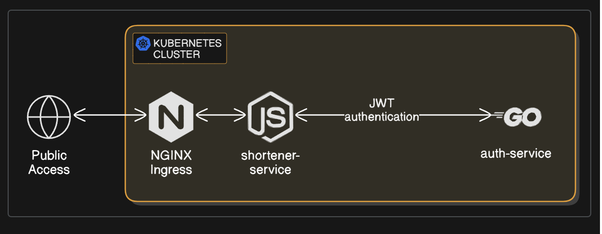

# DEVOPS

## App Flow
1. HIT LOGIN API shortener-service with parameter JSON username and  password would get response JWT
2. HIT SHORTEN API shortener-service with parameter JWT customkey url would get response shortenURL
3. HIT SHORTENED API with query param shortenURL redirect to URL



## CI/CD Pipeline
CI/CD pipeline running on top of Github Actions that running on kubernetes
1. Clone the source code from git repository
2. Build docker image  and push to registry ( https://hub.docker.com/u/billyvande7 )
3. Hit argocd using argoCD CLI to create new application
4. Set image parameter to argocd app
5. Sync argocd app
6. Observing the application

>public endpoint for querier service : https://test.zhuxin.my.id/

# Quick Start
```
# modify .env.test file as environment variable
# auth service
cd auth-service
docker-compose up -d --build
# shortener service
cd shortener-service
docker-compose up -d --build
```

## Tech Stack
- Kubernetes 
- Github Actions (CI/CD)
- ArgoCD (GitOps)
- Ingress Nginx
- Cert-Manager
- SQLite
- Shortener Service ( NodeJS )
- Auth Service ( Go lang )

## Qapla'